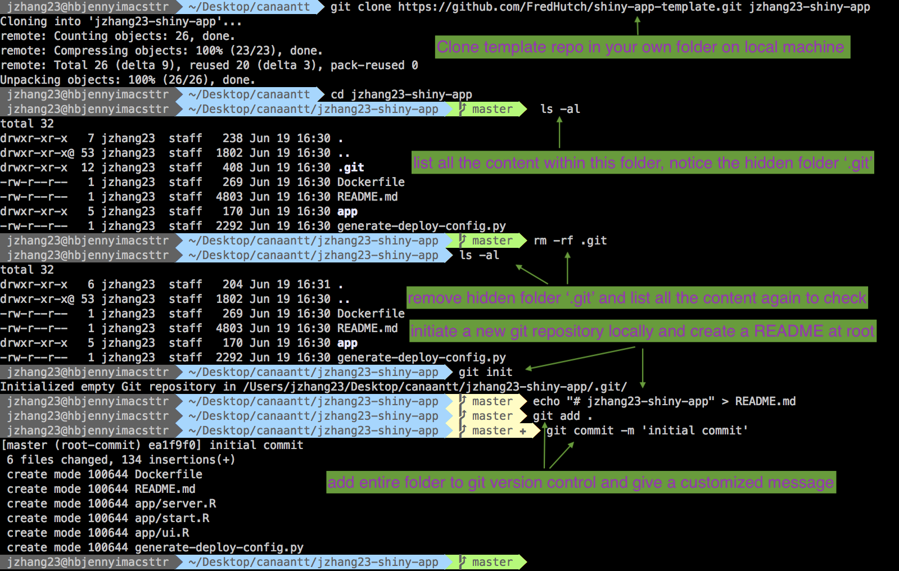
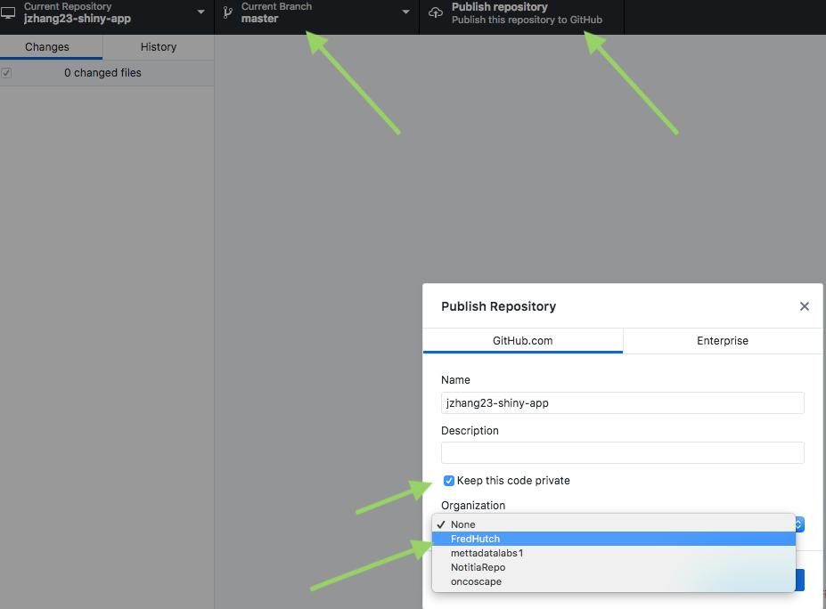
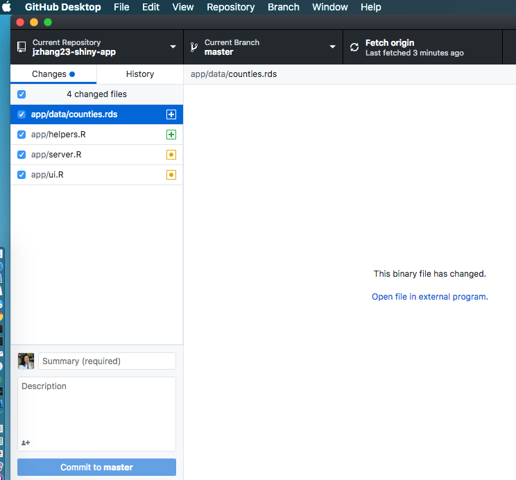
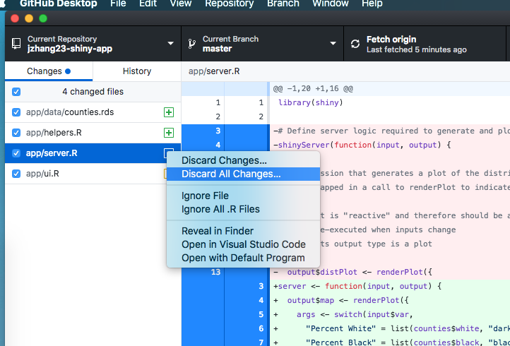
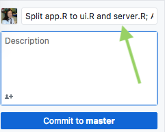
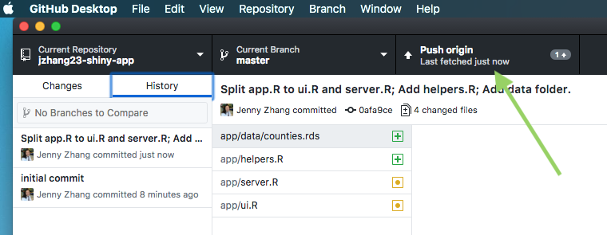
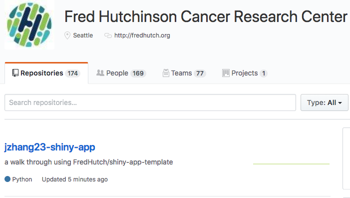

Shiny is an R package that makes it easy to build interactive web apps straight from R. You can host standalone apps on a webpage or embed them in R Markdown documents or build dashboards. You can also extend your Shiny apps with CSS themes, htmlwidgets, and JavaScript actions. For more information about Shiny, [go to Rstudio's Shiny page.](https://shiny.rstudio.com)

## GitHub Setup
To deploy a Shiny app via the Fred Hutch system, you must first have access to the Fred Hutch institution GitHub.  [You can find GitHub instructions in this demo.](https://fredhutch.github.io/wiki/compdemos/comp_github/)

## Download the Template
The template for your app can be found in this GitHub Repo (accessible after login):
[FredHutch/Shiny-app-template](https://github.com/FredHutch/shiny-app-template)

### Using Command Line Git

```
    git clone https://github.com/FredHutch/shiny-app-template.git <your_app_folder>
    cd <your_app_folder>
    ls -al
    rm -rf .git
    ls -al
    git init
    echo "# <your_app_folder>" > README.md
    git add .
    git commit -m 'initial commit'
```
After the steps above from a terminal, you have achieved these steps:
- Cloned a template
- Created your own repo
- Add a new git control to this repo

Now it's time to inject your wonderful shiny app to this template. The goal is to put all your app code base to template's subfolder 'app'.  

### Using the GitHub Desktop Application

To keep track of file changes within a local repo, first add this folder to GitHub Desktop Application:


You can create a remote repo by clicking on the 'Publish repository' and select the correct branch (in this case 'master' is the branch name). You can specify if you want this repo to be private or not. Also, please make sure this repo is under FredHutch as the organization.


## Insert Your App into the Template
Use your favorite code editor to add your own shiny app content to this template.  Here are a few reminders for the shiny apps with a single R script:

- Please split your app.R to ui.R and server.R according to the template app subfolder's file structure.
- Make sure you include 'library(shiny)' to both ui.R and server.R files
- In server.R, please remove 'shinyApp(ui, server)'
- You can add your data to a data folder under app folder

## Push Edits to GitHub
After you added your own content to this repo, you are ready to commit the changes and push the changes to the remote repo.

- Now your GitHub Desktop Application console looks like this:


- Two files with green crosses on the right have been added as new files.
Two existing files have been modified with yellow dots on the right.
You can further examine and adjust those changes by click the yellow dot or right click:


- Writea commit message and click on 'commit to master' if you want to commit change to your master branch:


- Push committed change from local files to remote repo


## Viewing Your App
You should be able to find your app within the repo you created


<!--Please also add topics 'r' and 'shiny'
-->

## Test Your Application Locally
Open the app in an R console.


- Change directory to subfolder 'app' under your app root:
``` 
    cd <your_app_folder>
    cd app
    R
```
- Via R console, 
``` 
    source('start.r') 
```

- Then go to a browser to check the url: http://localhost:7777


## Deployment Service from SciComp
Hopefully, you can see your app working as expected in the browser. Please keep a good record of all your dependencies. You may have all the necessary R packages installed on your local machine but SciComp deployment platform needs to know those dependencies.  You also want to be ready to answer all the questions below before you contact Scientific Computing team.  If you feel ready with your **codebase** as well as the **below information required by deployment**, contact Scientific Computing at `scicomp` to start the process of deploying your application on a server so others can access it.

1.  Is your application codebase version-controlled by Git and in a GitHub repository (repo) ?  If so, is it under FredHutch account?

2. How do you want to name (DNS name) your application? So the it will look something like **<your_application_DNS_name>.fredhutch.org**

3. Is your application facing Fred Hutch **internally** (open to the Fred Hutch campus) or **externally** (open to the entire internet)?

4. Does your application require authorization (log in), that only your collaborators have access?

5. Does your application contain PHI? Please remove PHI from your application?

6. Please list out all the dependencies (R packages you used).


## Available Resources
- [Introduction to Shiny with a cheatsheet and some example apps](http://zevross.com/blog/2016/04/19/r-powered-web-applications-with-shiny-a-tutorial-and-cheat-sheet-with-40-example-apps/)
- [How to get started with Shiny apps](https://shiny.rstudio.com/articles/build.html)
- [Which GitHub protocol should I use?](https://gist.github.com/grawity/4392747)
- [Tutorial](http://shiny.rstudio.com/tutorial/)
- [Shiny cheatsheet](http://shiny.rstudio.com/images/shiny-cheatsheet.pdf)
- [Shiny articles](http://shiny.rstudio.com/articles/)
- [Show me shiny](http://www.showmeshiny.com/)
- [Shinyapps.io](http://www.shinyapps.io/)
- [Gallery](http://shiny.rstudio.com/gallery/google-charts.html)
- [Shiny Google User Group](https://groups.google.com/forum/#!forum/shiny-discuss)
