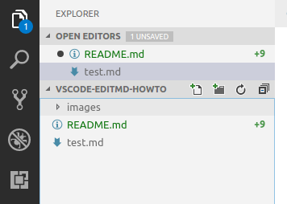
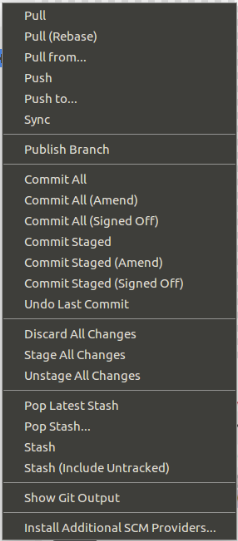
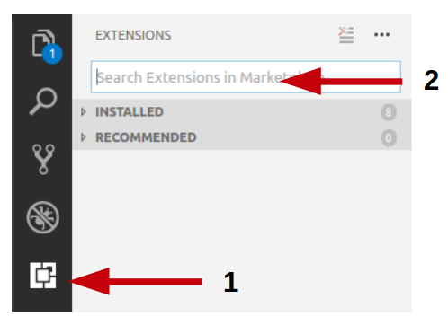

# What is Markdown?
[Markdown](https://en.wikipedia.org/wiki/Markdown) is a formatting language used when the resulting document will be rendered or converted into html documents for web-viewable material.  The format is commonly used to generate documents like readme's in GitHub or blog posts and even this website.  Markdown documents are written in plain text, and thus are often simpler to create, edit and manage using text editors intended for writing code.  This page includes a how-to discussion of using VSCode, a software package (and associated customizing plugins) intended for writing code that lends itself well to markdowns as well.  

## Markdown References
There are multiple "flavors" of markdown, for example, this site is rendered using GitHub-flavored markdown. More detailed isntructions for the various types of formatting possible using GitHub flavored markdown can be found [here.](https://help.github.com/categories/writing-on-github/)  A handy Markdown Cheatsheet is also available [here,](https://github.com/adam-p/markdown-here/wiki/Markdown-Cheatsheet) and can serve as a useful refresher for the formatting required in your markdown in order to use automatic formatting features such as headings, table of contents, tables, links, image embedding and comments.  


# Visual Studio Code for Working with Markdowns

VSCode is [freely available here](https://code.visualstudio.com/Download) and is supported on all major operating systems (Windows, macOS & Linux). Download the correct version for your platform and install it.  Note, on a Mac you may need to drag the application icon from wherever you unpacked the zip to your Applications folder.  This editor has a variety of features that are useful for editing markdowns including an option to toggle a preview pane to view the rendered markdown as you edit.  Then there are user developed plugins that can be installed when needed to tailor the editor to your specific needs.  


## Creating and Editing Markdown documents

To get started creating or editing markdown files, you should already have a folder set up where you will be working wiht your markdown files (e.g., a cloned GitHub repo like the one this site is generated from, a folder containing your documentation) on your workstation. From the VSCode "File" menu, select "Open Folder" or "Open" (on a Mac) and navigate to the folder containing the files you wish to edit, or to the empty folder you will be creating new documents in. The image below shows and open folder with some markdown files to edit. If you open a folder then all available documents in the folder will show up in the left sidebar, allowing you to switch between documents by simply selecting the files.  



Select an existing file or create a new file (File --> New File) and save it with the `.md` extension. When you click on the file name it will open a tab and display the contents of the file.

To see a live side-by-side preview of the rendered markdown document to check the formatting and see any images, you can click on the split window with magnifying glass icon in the upper right of the `open files` tab. After clicking on this tab, a new pane will appear on the right and display the rendered markdown.


**Note:** While it's possible to edit markdown files from random locations in your file system in a one-off manner without opening the folder in VSCode, opening the folder is required for the features of some plugins and linters to work correctly.  

## Git Integration

VSCode has built-in support for Git repositories (you still need Git installed on your workstation if it's not already present).

If the folder you have open to edit files is a Git repo, any changes made to files that you've saved, the "Git" icon **(1)** in the left toolbar will have a blue circle indicating how many un-staged/un-committed files there are. To stage (git add) a file that you wish to commit, click on the Git icon, then the file that you want to stage. Click on the "+" icon **(2)** to stage the file. To commit the changes, enter a commit message in the message box **(3)** and then click the check mark icon **(4)**.


To push your changes to a remote repository, pull in any new changes from the remote repository or other git functions, click on the "**...**" icon **(5)** to reveal the full Git menu:




## Installing Plugins

After you have VSCode installed, you can start creating and editing markdown files right away, but there are a few VSCode plugins that will be very helpful. These plugins will allow you to easily paste images into your documents and check the spelling.

To install a plugin, in VSCode, click on the square extensions icon in the upper left tool bar **(1)**, then in the search box **(2)** type the name of the plugin you wish to install, find the plugin you are looking for in the results, click on it and then click on the green "Install" button. After it's installed you'll need to reload VSCode to use it.



Below are the recommended plugins for authoring Markdown:

### Plugin: Paste Image

The "Paste Image" plugin is a huge time saver if your documentation will contain lots of images. Install the Paste Image plugin from "mushan".

By default, Paste Image will create (if it doesn't already exist) a single "images" folder at the root of your open directory structure for all images pasted. If you would like to keep your images folder at the same level of the directory structure as your markdown document (to keep them together), you can make the following configuration change. Go to **"File"** --> **"Preferences"** --> **"Settings"** and in the **"User Settings"** configuration section, add the following "pasteImage.*  entries between the curly braces like this:

```json
{
    "pasteImage.basePath": "${currentFileDir}",
    "pasteImage.path": "images",
}
```

**Note:** if you are editing markdown that is destined for the [Fred Hutch Wiki](https://fredhutch.github.io/wiki/) use "assets" rather than "images" in the setting above.*

After Paste Image is installed and configured, you can simply copy your prepared image or screenshot, insert the cursor where you want to insert the image in the document and use **Ctrl+Alt+V** on Windows or Linux and **Cmd+Alt+V** on macOS. This will automatically create the images folder if doesn't already exist and place your image there naming it with a date/timestamp. The inserted text int the editor will look like the following:

```

```

Between the empty square brackets, you can place "alt-text" describing the image (it won't be displayed in your browser or the preview). Without this "alt-text" the Markdown linter (plugin) will provide a warning, but it's O.K. to leave it empty if you like.

More information about this plugin is available [here](https://marketplace.visualstudio.com/items?itemName=mushan.vscode-paste-image)

***NOTE:** To get the Paste Image working on Linux, I had to install the "**xclip**" package on my Workstation (sudo apt install xclip)*

### Plugin: Spellchecker

VSCode doesn't include a built-in spell checker. To add a spell checker to VSCode, install the "Code Spell Checker" plugin from "Street Side Software". After the plugin is installed (and VSCode reloaded) it should automatically start finding typos. There will be a green squiggly line under the suspect word. If the word is misspelled you can click on the word and a yellow light bulb icon will appear. Click on the light bulb icon and a menu should appear offering you suggestions. If the suspected work is in fact spelled correctly you can use the same context menu to add it to your local dictionary.


More information about this plugin is available [here](https://marketplace.visualstudio.com/items?itemName=streetsidesoftware.code-spell-checker)


### Plugin: MarkdownLint

A markdown linter may also be useful to help you write correctly formated makrdown. Install the "markdownlist" plugin from David Anson. It works exactly like the Spellchecker plugin. Hovering your cursor over the green squiggly underline will reveal the warning from the linter; clicking on the light bulb will reveal a click you can click to learn more about what you are doing wrong.

More information about this plugin is available [here](https://marketplace.visualstudio.com/items?itemName=DavidAnson.vscode-markdownlint)
